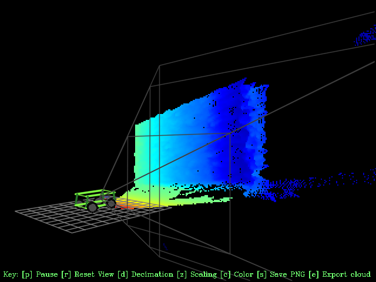

# CASE Folkrace Car

## The 2020 Folkrace car project
 A car developed for the main focus of evaluationg, methos for producing a fun and educational car for the Robot SM Folkrace class.
 These are the main topics:
- Navigation
- Mapping/ localisation
- Electric design
- Cassis design
- Weight optimization

## Placeholder

## System overview

## How do you use it?

## How does it work?

## Development

## Contributors

## License

Distributed under the MIT license. See ``LICENSE`` for more information.