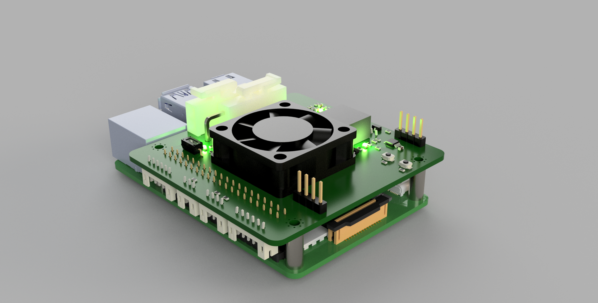

# Hardware - CASE Folkrace Car

This document describes a general overview of the system hardware used.

### Preliminary rendering of electronics

### Todo hardware
* Add connector for hall effect sensor (should include pull-up)
* Connector for RP4: [Adafruit 2223](https://www.adafruit.com/product/2223) [(from Mouser)](https://www.mouser.se/ProductDetail/Adafruit/2223?qs=%2Fha2pyFaduidPXPXSuFTA%252Bpgx%252BFdWwp2gD3vvkg%2FNZGxFnQuzv6LiQ%3D%3D)

